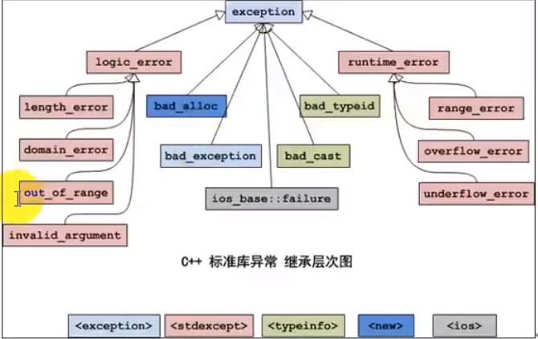

# 异常

异常处理机制提供了一种将控制和信息从程序执行中的某个点传输到与该点相关联的处理程序的方法，简而言之，异常处理将控制权向上传递至函数调用堆栈。

在C++中，**throw-exception**、**dynamic_cast**、**typeid**、**new-expression**、**allocation function**、**标准库的一些函数(std::vector::at, std::string::substr, etc)**可以抛出异常，并且必须有一个与异常对象的类型相匹配的catch子句。

为了程序正常捕获异常，异常表达式必须被包含在**try-block**或者**try-block中调用的函数中**

定义函数时，应遵守下述的规范

### Dynamic exception specification

显式动态异常规范应仅出现在函数类型的函数声明符、指向函数类型的指针、指向函数类型的引用或指向作为声明或定义的顶级类型的成员函数类型的指针上，或出现在此类在函数声明器中作为参数或返回类型出现的类型。

```C++
void f() throw(int);            // OK: function declaration
void (*pf)() throw (int);       // OK: pointer to function declaration
void g(void pfa() throw(int));  // OK: pointer to function parameter declaration
typedef int (*pf)() throw(int); // Error: typedef declaration
```

如果在函数声明时，类型T在显式异常列表中，即  void function() throw(T) ， 这表明，该函数有可能抛出T类型或者T类型子类的异常。显式异常列表为空的函数，即 void function() throw()，不允许抛出异常。

异常规范中不允许除了cv void*以外不完整类型、指向不完整类型的指针/引用，右值引用同样不被异常规范允许。数组和函数类型（如果使用）将调整为相应的指针类型。允许使用参数包（自 C++11 起）。

动态异常规范不被视为函数类型的一部分。

如果函数抛出的异常类型不再函数异常规范列表中，std::unexpected函数将会调调用，该函数默认调用std::terminate（该函数将终止程序），同时，用户可以自定义std::unexpected函数的实现（通过std::set_unexpected）。如果异常规范接受从 std::unexpected 引发的异常，则堆栈展开将照常继续。如果不是，但异常规范允许 std::bad_exception，则会抛出 std::bad_exception。否则，将调用 std::terminate。

注意，当函数声明后跟随 ****noexcept(true)****时，该函数无可抛出的异常类型。当函数无显式异常规范和****noexcept(true)****时，该函数被允许抛出任意形式的异常。

> 对于隐式声明的特殊成员函数（构造函数、赋值运算符和析构函数）和继承构造函数（自 C++11 起），潜在异常集是它们将调用的所有内容的潜在异常集的组合：非变体非静态数据成员的构造函数/赋值运算符/析构函数、直接基，以及在适当的情况下，虚拟基（包括默认参数表达式， 一如既往）

每个表达式 e 都有一组潜在的异常。如果 e 是核心常量表达式，则该集合为空，否则，它是 e 的所有直接子表达式（包括默认参数表达式）的潜在异常集合的并集，与依赖于 e 形式的另一个集合组合在一起。

```C++
void f() throw(int); // f()'s set is "int"
void g();            // g()'s set is the set of all types
 
struct A { A(); };                  // "new A"'s set is the set of all types
struct B { B() noexcept; };         // "B()"'s set is empty
struct D() { D() throw (double); }; // new D's set is the set of all types
```

```C++
struct A
{
    A(int = (A(5), 0)) noexcept;
    A(const A&) throw();
    A(A&&) throw();
    ~A() throw(X);
};
 
struct B
{
    B() throw();
    B(const B&) = default; // exception specification is "noexcept(true)"
    B(B&&, int = (throw Y(), 0)) noexcept;
    ~B() throw(Y);
};
 
int n = 7;
struct D : public A, public B
{
    int * p = new (std::nothrow) int[n];
    // D has the following implicitly-declared members:
    // D::D() throw(X, std::bad_array_new_length);
    // D::D(const D&) noexcept(true);
    // D::D(D&&) throw(Y);
    // D::~D() throw(X, Y);
};
```

```C++
#include <iostream>
#include <exception>
#include <cstdlib>
 
static_assert(__cplusplus < 201700, 
    "ISO C++17 does not allow dynamic exception specifications.");
 
class X {};
class Y {};
class Z : public X {};
class W {};
 
void f() throw(X, Y) 
{
    int n = 0;
    if (n) throw X(); // OK
    if (n) throw Z(); // also OK
    throw W(); // will call std::unexpected()
}
 
int main()
{
    std::set_unexpected([]
    {
        std::cout << "That was unexpected!" << std::endl; // flush needed
        std::abort();
    });
    f();
}
```

> 以下类型是不完整类型：类型 void（可能是 cv 限定的）； 未完全定义的对象类型：已声明（例如通过前向声明）但未定义的类类型； 未知边界数组； 不完整类型的元素数组； 从声明点开始的枚举类型，直到确定其基础类型。
>    所有其他类型都已完成。

#### try catch

```C++
int func(int a, int b) {
    if (b == 0) throw 0; // 抛出一个 int 类型的异常
}

void test() {
    int a = 10, b = 0;
    try {
        func(a,b);
    } catch (int e) { // 接收（监听）一个 int 类型的异常
        std::cout << "exception : " << e << std::endl;
    }
}
```

## 异常的优势

- 异常可以使用复杂的对象传递信息

```C++
class Maker {
public:
	Maker(std::string message) : str(message) {};
    void printMaker() {
        std::cout << str << std::endl;
    }
private:
    std::string str;
};

int func(int a, int b) {
    if (b == 0) throw Maker("除数不能为零");
}

void test() {
    int a = 10, b = 0;
    try {
        func(a,b);
    } catch (Maker m) { 
        m.printMaker();
    }
}
```

- 异常不能忽略，否则会报错。如果匹配的异常处理未找到，则运行函数terminate将自动调用，其缺省功能调用abort，终止程序
- 逐层依赖处理异常

```C++
class Maker {
public:
	Maker(std::string message) : str(message) {};
    void printMaker() {
        std::cout << str << std::endl;
    }
private:
    std::string str;
};

int func(int a, int b) {
    if (b == 0) throw Maker("除数不能为零");
}

void test() {
    int a = 10, b = 0;
    try {
        func(a,b);
    } catch (Maker m) { 
        m.printMaker();
    } catch (exception e) {
        throw; // 在test函数中无法处理该异常，将该异常向上传递，即调用test函数的作用域
    }
}
```

## 严格的类型匹配

```C++
try {
    
} catch(...) { // 接受所有类型的异常
    
}
```

## 异常的接口声明

```C++
void func() throw(int, char) {} // 在func函数中 只能抛出int char的类型的异常
```

## 栈解旋

**栈解旋**：当发生异常时，**从进入try块后，到异常被抛掷前**，这期间在栈上的构造的所有对象都会被自动析构。析构的顺序与构造的顺序相反，这一过程被称为栈的解旋（unwinding） （**注意栈解旋发生的时间段~**）

```C++
class Maker {
public:
	Maker(std::string message) : str(message) {std::cout << "construct" << std::endl; };
    ~Maker() {std::cout << "destruct" << std::endl;}
    void printMaker() {
        std::cout << str << std::endl;
    }
    
private:
    std::string str;
};

int func(int a, int b) {
    if (b == 0) {
        Maker m("除数不能为零") // 函数未结束，该对象就会被析构
        throw m; // 发生了拷贝构造
        
        // throw Maker("除数不能为零")  // 这里只产生了一个对象，无栈解旋现象
    }
}

void test() {
    int a = 10, b = 0;
    try {
        func(a,b);
    } catch (const Maker& m) { // 用引用，减少一次拷贝构造的开销
        m.printMaker();
    } catch (exception e) {
        throw; // 在test函数中无法处理该异常，将该异常向上传递，即调用test函数的作用域
    }
}
```

## 异常变量的生命周期


## 异常的多态


## 标准异常类



- 在上述继承体系中，每个类都提供了构造函数、拷贝构造函数、赋值构造函数
- logic_error类及其子类、runtime_error类及其子类，它们的构造函数是接受一个string类型的形式参数，用于异常信息描述。
- 所有的异常都有一个what()方法，返回const char* 类型的值，描述异常信息

